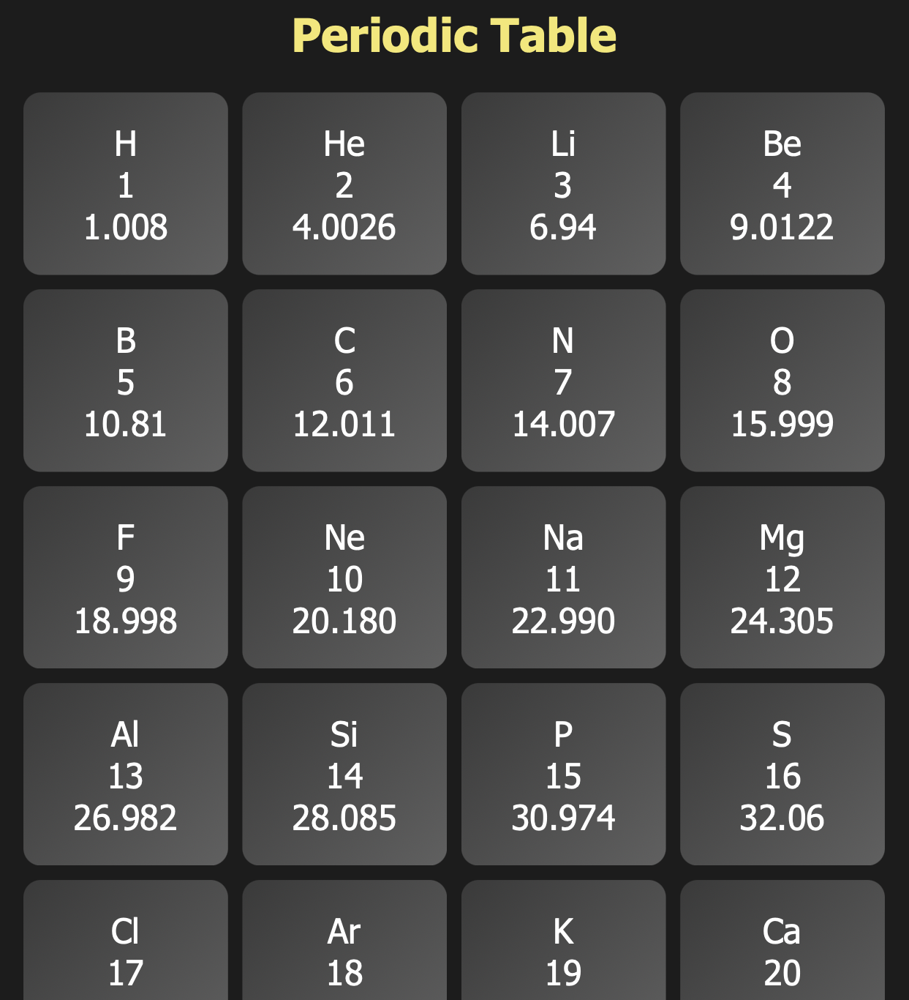
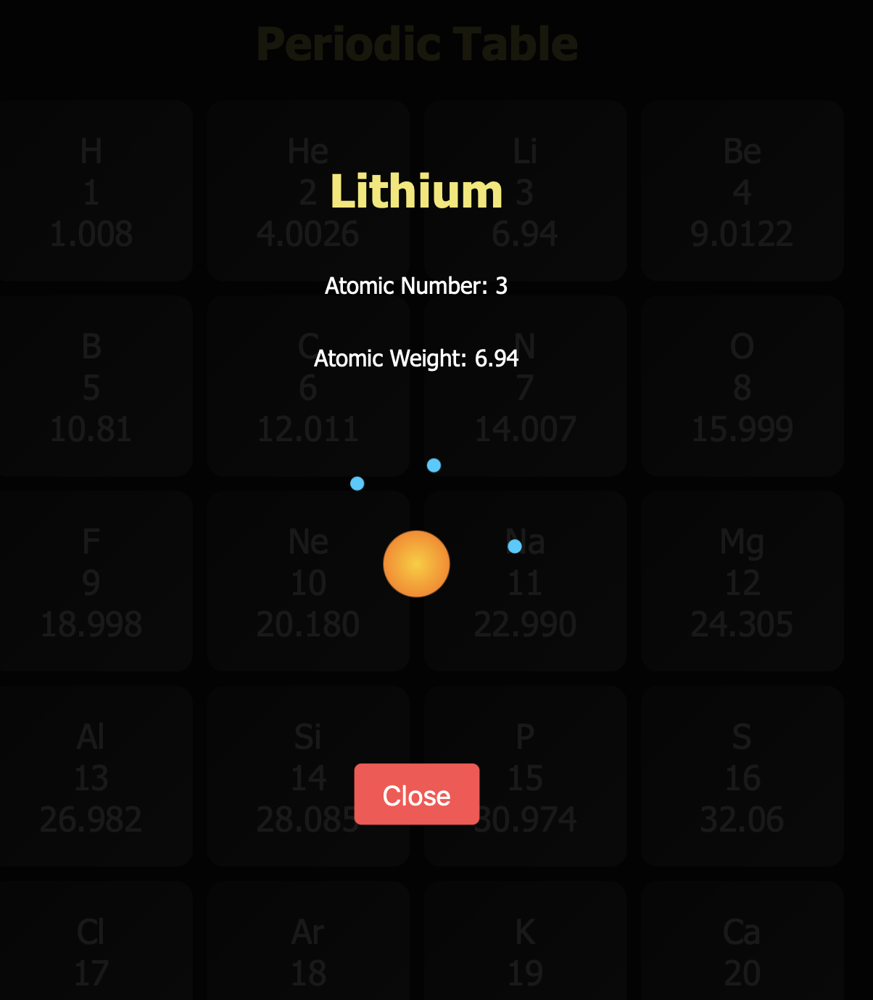

# Lab

An interactive web app that visualizes atomic structures with animated electrons orbiting the nucleus based on the element's atomic number.

## Features

- Dynamic visualization of atomic structures
- Animated electron orbits
- User-friendly interface

## Screenshots

    
    

## Usage

To run the app, open `index.html` in your web browser. Click on an element to see its atomic structure.
